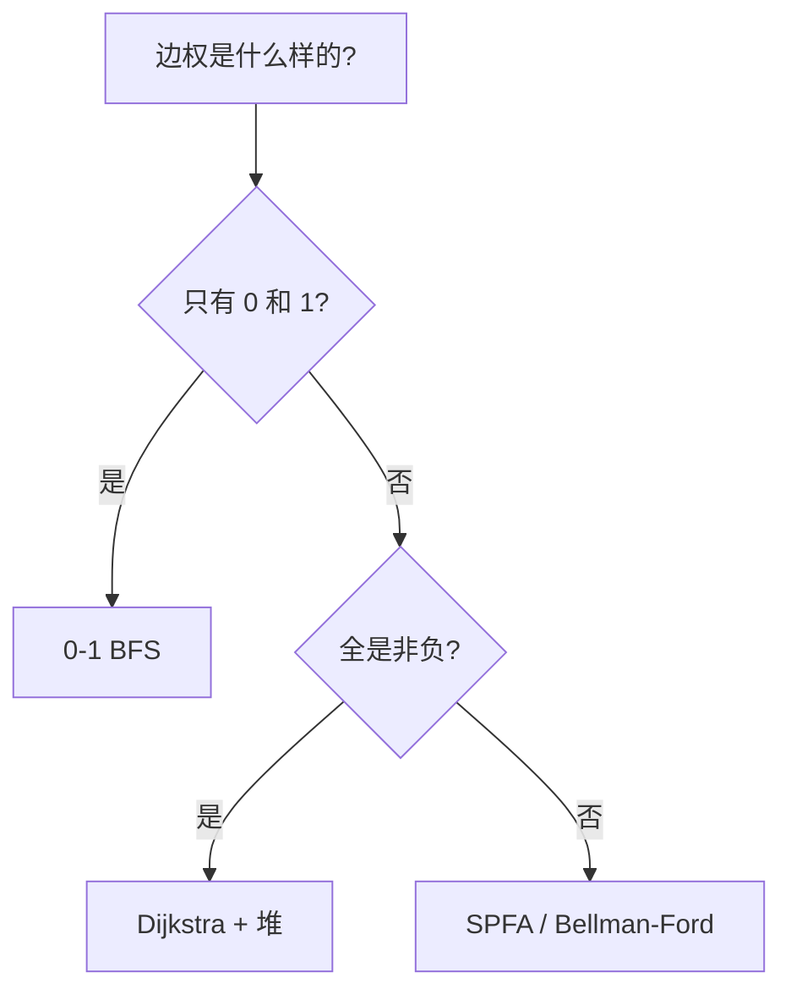

# 最短路三剑客：0-1 BFS / Dijkstra（堆优化）/ SPFA

> 三种"松弛 + 队列"的最短路算法，核心区别只有一句话：**出队顺序有没有保证**。

---

## 一、本质：出队顺序决定一切

三者共享同一套松弛骨架：

```python
if dist[u] + w < dist[v]:
    dist[v] = dist[u] + w
    把 v 塞进队列
```

差别全在"按什么顺序出队"：

| 算法 | 容器 | 出队顺序 | 出队时 dist 是否最终 | 复杂度 |
|------|------|---------|--------------------|--------|
| 0-1 BFS | deque | 队头（两层有序） | ✅ 是 | $O(V+E)$ |
| Dijkstra（堆） | 最小堆 | 全局最小 | ✅ 是 | $O((V+E)\log V)$ |
| SPFA | 普通队列 | FIFO，无保证 | ❌ 不一定 | 最坏 $O(VE)$ |

- **"弹出即确定"** 是提前返回、惰性删除旧条目的依据；
- SPFA 没有这个性质，必须把队列跑空。

---

## 二、0-1 BFS：只有 0/1 两种边权

### 原理

边权只有 0 和 1 时，队列中所有节点的 dist 只可能等于当前最小值 $d$ 或 $d+1$——Dijkstra 的"取全局最小"退化成了"两个桶"：

- 0 边松弛 → dist 不变（$d$）→ 插**队头**；
- 1 边松弛 → dist 变 $d+1$ → 插**队尾**。

deque 始终保持按 dist 非降序，所以弹出即确定，等价于 Dijkstra 但操作 $O(1)$。

### 模板（1368. 使网格图至少有一条有效路径的最小代价）

顺着箭头走代价 0，改箭头代价 1：

```python
from collections import deque


class Solution:
    def minCost(self, grid: list[list[int]]) -> int:
        INF = 10 ** 9
        n, m = len(grid), len(grid[0])
        dist = [[INF] * m for _ in range(n)]
        dist[0][0] = 0
        Q = deque([(0, 0)])
        while Q:
            x, y = Q.popleft()
            if x == n - 1 and y == m - 1:
                return dist[x][y]          # ✅ 弹出即确定，可提前返回
            for dx, dy, dir in [(1, 0, 3), (-1, 0, 4), (0, 1, 1), (0, -1, 2)]:
                nx, ny = dx + x, dy + y
                if 0 <= nx < n and 0 <= ny < m:
                    w = 0 if dir == grid[x][y] else 1
                    if dist[x][y] + w < dist[nx][ny]:
                        dist[nx][ny] = dist[x][y] + w
                        if w == 0:
                            Q.appendleft((nx, ny))   # 队头
                        else:
                            Q.append((nx, ny))       # 队尾
```

### 要点与坑

1. **`appendleft` 是精髓**：它维持"两层有序"不变量；全部改成 `append` 就退化成了 SPFA，$O(V+E)$ 保证消失；
2. 第一次弹出终点即为答案，可提前返回；
3. 只适用于边权 ∈ {0,1}；本质是 Dial 算法（桶排 Dijkstra）在只有两个活跃桶时的特例。

---

## 三、Dijkstra + 堆优化：任意非负边权

### 原理

每次从堆中弹出 dist 最小的节点。非负权保证：之后任何路径都无法把它改进得更小 → **弹出即确定**。

### 模板（邻接表 + 惰性删除）

```python
import heapq


def dijkstra(adj: list[list[tuple[int, int]]], start: int) -> list[int]:
    INF = 10 ** 9
    dist = [INF] * len(adj)
    dist[start] = 0
    heap = [(0, start)]                     # (距离, 节点)
    while heap:
        d, u = heapq.heappop(heap)
        if d > dist[u]:                     # 陈旧条目，跳过
            continue
        for v, w in adj[u]:
            if d + w < dist[v]:
                dist[v] = d + w
                heapq.heappush(heap, (dist[v], v))
    return dist
```

### 要点与坑

1. **惰性删除**：节点可能多次入堆，靠 `d > dist[u]` 跳过旧条目；
2. 带状态的 Dijkstra：把"图上的一个点"推广成"一个状态"，如 1293 的 `(x, y, 剩余消除)` 三维状态——但边权全 1 时退化成 BFS，用 deque 更快；
3. 经典题：743. 网络延迟时间、1514. 概率最大的路径（乘积最短路）。

---

## 四、SPFA：能处理负权，但无保证

### 原理

队列版 Bellman-Ford：节点被改进就入队，反复松弛直到没有改进。因为**出队时 dist 不一定是最终值**，节点可能反复进出队列。

### 模板

```python
from collections import deque


def spfa(adj: list[list[tuple[int, int]]], start: int) -> list[int]:
    INF = 10 ** 9
    n = len(adj)
    dist = [INF] * n
    dist[start] = 0
    inq = [False] * n
    q = deque([start])
    inq[start] = True
    while q:
        u = q.popleft()
        inq[u] = False
        for v, w in adj[u]:
            if dist[u] + w < dist[v]:
                dist[v] = dist[u] + w
                if not inq[v]:
                    q.append(v)
                    inq[v] = True
    return dist
```

### 要点与坑

1. **不能提前返回**：终点出队后还可能被更短路径更新，必须跑空队列再取 `dist[终点]`；
2. 最坏 $O(VE)$，非负图上可能被卡（1368 用 SPFA 就从 $O(V+E)$ 退化成 $O(VE)$）；
3. 主场是**负权边**和**判负环**（节点入队次数 ≥ V 说明存在负环）；非负图应选 0-1 BFS 或 Dijkstra。

---

## 五、选型决策

| 边权 | 算法 | 备注 |
|------|------|------|
| 全为 1 | 普通 BFS | deque 即可 |
| 全为 0/1 | 0-1 BFS | deque 队头/队尾 |
| 非负任意值 | Dijkstra + 堆 | 弹出即确定 |
| 有负权 / 判负环 | SPFA / Bellman-Ford | 无"弹出即确定" |



---

## 六、相关题

| 题号 | 题目 | 用哪个 |
|:---:|------|--------|
| 1368 | 使网格图至少有一条有效路径的最小代价 | 0-1 BFS |
| 1293 | 网格中的最短路径 | 3D 状态 BFS（边权全 1；0-1 建模会混淆"消除次数"与"步数"两个目标） |
| 743 | 网络延迟时间 | Dijkstra |
| 1514 | 概率最大的路径 | Dijkstra（乘积最短路） |
| 994 | 腐烂的橘子 | 多源 BFS |
